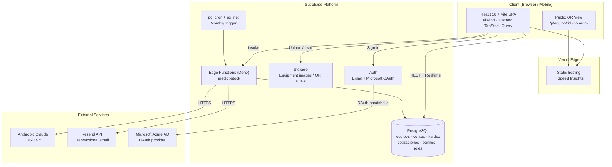
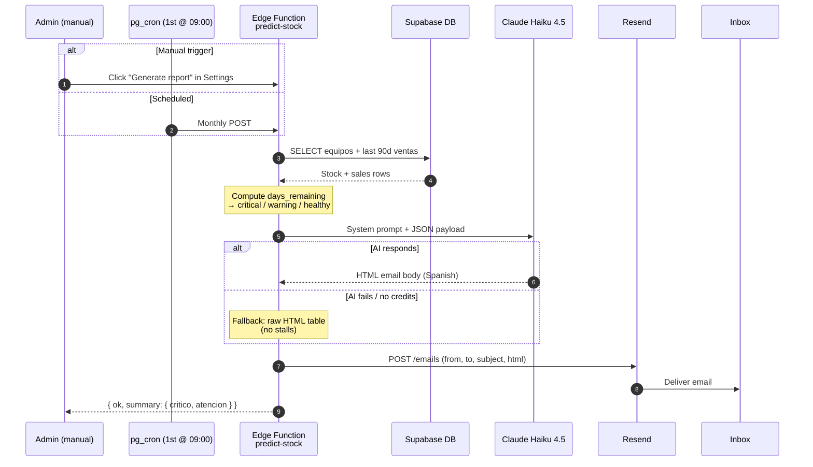

# GeoStock

> Web-based inventory management system for **Geotop Perú S.A.C.** — a geodesy and topography equipment rental company based in Miraflores, Lima.

[](./package.json)
[](#)
[](https://react.dev/)
[](https://vitejs.dev/)
[](https://supabase.com/)
[](#)

GeoStock replaces manual spreadsheets with real-time inventory tracking, QR-based equipment verification in the field, a full sales / quotation workflow, AI-assisted restock forecasting, and role-based dashboards.

---

## Table of contents

1. [Overview](#overview)
2. [System architecture](#system-architecture)
3. [Modules](#modules)
4. [AI restock forecast](#ai-restock-forecast)
5. [Role-based access (RBAC)](#role-based-access-rbac)
6. [Tech stack](#tech-stack)
7. [Project structure](#project-structure)
8. [Getting started](#getting-started)
9. [Available scripts](#available-scripts)
10. [Testing](#testing)
11. [Deployment](#deployment)
12. [Author](#author)

---

## Overview

GeoStock is built as a Single Page Application backed by Supabase (PostgreSQL + Auth + Edge Functions + Storage). The frontend uses React 18 with a custom **NeonReactUI** design system (dark theme, teal accent `#00C9A7`). The system covers four end-to-end flows:

| Flow | Modules involved |
|---|---|
| **Equipment lifecycle** | Inventory · Warehouses · QR Scanner |
| **Sales pipeline** | Quotations → Sales → Kardex |
| **Procurement** | Suppliers → Purchases → Kardex |
| **Insight & forecasting** | Reports + AI-generated restock email |

---

## System architecture



> Source: [`docs/diagrams/architecture.mmd`](./docs/diagrams/architecture.mmd)

---

## Modules

```mermaid
graph LR
    subgraph Principal
        DASH[Dashboard<br/>home stats]
        INV[Inventory<br/>equipos + stock]
        REP[Reports<br/>charts + PDF]
    end

    subgraph Operations
        BUY[Purchases]
        QUO[Quotations]
        SAL[Sales]
        QR[QR Scanner]
    end

    subgraph Masters
        WH[Warehouses]
        SUP[Suppliers]
        CLI[Customers]
    end

    subgraph Admin
        USR[Users + Roles]
        CFG[Settings]
    end

    subgraph Services["Service Layer (src/lib/services)"]
        EQS[equipoService]
        VTS[ventaService]
        CPS[compraService]
        CTS[cotizacionService]
        RPS[reportService]
        ALS[almacenService]
        CLS[clienteService]
        PVS[proveedorService]
        UZS[usuariosService]
        CGS[configService]
        KXS[kardexService]
    end

    INV --> EQS
    SAL --> VTS
    BUY --> CPS
    QUO --> CTS
    REP --> RPS
    WH --> ALS
    CLI --> CLS
    SUP --> PVS
    USR --> UZS
    CFG --> CGS
    INV --> KXS

    Services -->|@supabase/supabase-js| Supabase[(Supabase)]
```

> Source: [`docs/diagrams/modules.mmd`](./docs/diagrams/modules.mmd)

**Module summary**

| Group | Module | Purpose |
|---|---|---|
| Principal | Dashboard | Global KPIs (Admin only) |
| Principal | Inventory | Equipment CRUD, stock per warehouse, low-stock alerts |
| Principal | Reports | Recharts visualizations, top-5 selling, PDF export |
| Operations | Purchases | Supplier orders, stock-in via `fn_registrar_compra` |
| Operations | Quotations | Multi-product quotation builder → converts to Sale |
| Operations | Sales | Multi-product sales via `fn_registrar_venta`, IGV-compliant receipt PDF |
| Operations | QR Scanner | In-app camera scanner + public mobile view at `/p/equipo/:id` |
| Masters | Warehouses | Physical storage locations |
| Masters | Suppliers · Customers | Master data |
| Admin | Users | RBAC management |
| Admin | Settings | Company data (RUC, address) + IGV % + AI forecast trigger |

---

## AI restock forecast

A Supabase Edge Function aggregates the last 90 days of sales per item, computes estimated days-of-stock remaining (`critical < 30d`, `warning < 60d`, `healthy ≥ 60d`), then asks **Claude Haiku 4.5** to draft a clear Spanish email with concrete restocking actions. The email is delivered via **Resend** and can be triggered:

- **Automatically** by `pg_cron` on the 1st of every month at 09:00.
- **Manually** from `Settings → Generate restock report` (Admin only) — used for live demos.



> Source: [`docs/diagrams/forecast-flow.mmd`](./docs/diagrams/forecast-flow.mmd) · Function code: [`supabase/functions/predict-stock/index.ts`](./supabase/functions/predict-stock/index.ts)

The function is **fault tolerant**: if the AI provider fails for any reason (network, quota, etc.), it ships the raw bucketed table instead — so the report always arrives.

---

## Role-based access (RBAC)

Permissions are centralized in [`src/lib/constants/permissions.js`](./src/lib/constants/permissions.js) and applied at three layers:

- **Routes** — every `Route` is wrapped in `RoleProtectedRoute` with `ROUTE_ROLES[<key>]`.
- **Sidebar** — items render only if the user's role is in `allowedRoles`.
- **Pages** — write actions (create / edit / delete) are conditionally rendered via `CAN_WRITE`.

| Module | Administrator | Warehouse (Almacén) | Sales (Ventas) | Technician (Técnico) |
|---|:-:|:-:|:-:|:-:|
| Dashboard home | ✅ | ↪︎ Inventory | ↪︎ Sales | ↪︎ Inventory |
| Inventory | full | full | read | read |
| Warehouses | full | full | read | read |
| Purchases | ✅ | ✅ | — | — |
| Sales | ✅ | — | ✅ | — |
| Quotations | ✅ | — | ✅ | — |
| Customers | ✅ | — | ✅ | — |
| Suppliers | ✅ | ✅ | — | — |
| Reports | all | inventory only | top-5 + monthly + quotations | — |
| Settings · Users | ✅ | — | — | — |
| QR Scanner | ✅ | ✅ | ✅ | ✅ |

> The current scope is **UX-layer RBAC**. Backend Row-Level Security policies are planned for a future iteration.

---

## Tech stack

**Frontend**
- React 18 · Vite 5 · React Router 7
- Tailwind CSS 3 (custom NeonReactUI tokens)
- Zustand (auth, inventory, sales, etc. stores)
- TanStack Query 5
- Recharts + @nivo for analytics
- Zod for form validation
- `qrcode` + `html5-qrcode` for QR generation and scanning
- `html2pdf.js` + `jspdf` for document export

**Backend & data**
- Supabase (PostgreSQL, Auth, Storage, Edge Functions in Deno)
- SQL migrations under `supabase/migrations/`
- `pg_cron` + `pg_net` for scheduled jobs

**External services**
- Anthropic Claude (Haiku 4.5) — AI-generated restock narrative
- Resend — transactional email
- Microsoft Azure AD — corporate single sign-on

**Tooling**
- Vitest + React Testing Library — unit / service tests (60+)
- Playwright — end-to-end happy path (`e2e/happy-path.spec.js`)
- ESLint + Commitlint + Husky + Commitizen
- Vercel — hosting + Speed Insights

---

## Project structure

```
NeonReactUI/
├── docs/
│   └── diagrams/                # Mermaid source for README diagrams
├── e2e/                         # Playwright end-to-end tests
├── src/
│   ├── components/
│   │   ├── dashboard/           # Pages, layouts, modals, drawers, sidebar
│   │   └── ui/                  # Atomic NeonReactUI primitives
│   ├── hooks/                   # useAuth, useEquipoForm, usePageTitle
│   ├── lib/
│   │   ├── constants/           # permissions, roles, inventory, almacen
│   │   ├── schemas/             # Zod validation schemas
│   │   └── services/            # Supabase service wrappers
│   ├── pages/                   # Standalone routes (public QR, 404)
│   ├── stores/                  # Zustand state slices
│   ├── test/                    # Vitest unit + service tests
│   └── App.jsx
├── supabase/
│   ├── functions/
│   │   └── predict-stock/       # Deno edge function for AI restock email
│   └── migrations/              # Versioned SQL migrations
├── playwright.config.js
├── vite.config.js
└── package.json
```

---

## Getting started

### Prerequisites

- **Node.js** ≥ 18 (LTS recommended)
- **npm** ≥ 9
- A **Supabase** project (free tier works)
- Optional for the AI report: **Anthropic** + **Resend** accounts
- Optional for E2E: **Playwright** browsers (`npx playwright install chromium`)

### 1. Clone and install

```bash
git clone https://github.com/fredsalv01/NeonReactUI.git
cd NeonReactUI
git checkout dev
npm install
```

### 2. Configure environment

Create a `.env` file at the project root (use `.env.example` as a template):

```env
VITE_SUPABASE_URL=https://<your-project-ref>.supabase.co
VITE_SUPABASE_ANON_KEY=<your-anon-key>
VITE_APP_URL=http://localhost:5173
```

For the AI restock report, add to your Supabase Edge Function secrets (not the `.env`):

```bash
supabase secrets set ANTHROPIC_API_KEY=<your-key>
supabase secrets set RESEND_API_KEY=<your-key>
```

Optionally, for E2E tests create `.env.local`:

```env
VITE_E2E_EMAIL=<seed-user-email>
VITE_E2E_PASSWORD=<seed-user-password>
```

### 3. Apply database migrations

```bash
supabase link --project-ref <your-project-ref>
supabase db push
```

### 4. Deploy the edge function (optional)

```bash
supabase functions deploy predict-stock --no-verify-jwt
```

### 5. Run the app

```bash
npm run dev
```

The app starts on **http://localhost:5173**.

---

## Available scripts

| Script | Description |
|---|---|
| `npm run dev` | Start the Vite dev server with HMR |
| `npm run build` | Production build into `dist/` |
| `npm run preview` | Preview the production build locally |
| `npm run lint` | ESLint over `src/` |
| `npm run lint:fix` | Auto-fix lint issues |
| `npm run test` | Run Vitest unit + service tests |
| `npm run test:ui` | Vitest interactive UI |
| `npm run test:coverage` | Coverage report |
| `npm run test:e2e` | Playwright end-to-end suite |
| `npm run commit` | Commitizen-guided conventional commit |
| `npm run scan` | Unlighthouse audit |

---

## Testing

- **Unit / service tests** — Vitest with mocked Supabase client. ~60 cases covering `equipoService`, `ventaService`, `compraService`, `cotizacionService`, `reportService`.
- **End-to-end** — Playwright (chromium) running against a real dev server. The happy-path spec covers `login → dashboard redirect`.

```bash
npm run test           # Vitest
npm run test:e2e       # Playwright
```

Tests skip gracefully when credentials are absent — no false greens.

---

## Deployment

The project deploys to **Vercel** with zero configuration thanks to Vite's adapter. `@vercel/speed-insights` is already wired in `src/App.jsx`. The Supabase edge function is deployed independently with the Supabase CLI.

```bash
vercel link
vercel env pull
vercel deploy --prod
```

---

## Author

**Freddy Alberto Morales Salvatierra**
Final-year Information Systems Engineering student at **Universidad San Ignacio de Loyola (USIL)**.

- 📧 [freddy.morales@usil.pe](mailto:freddy.morales@usil.pe)
- 💼 [linkedin.com/in/freddyams](https://linkedin.com/in/freddyams)
- 📞 +51 991 107 168

---

<p align="center"><sub>GeoStock v1.0.4 · Built with React + Supabase · 2026</sub></p>
